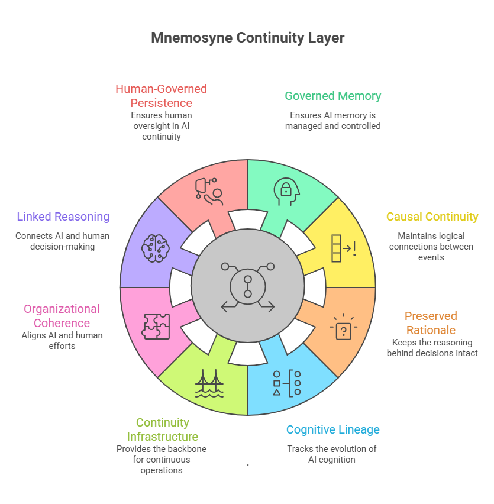

# Mnemosyne
## Continuity Architecture for Persistent Human–AI Cognition

Mnemosyne is a framework exploring continuity infrastructure for AI-native organizations.

The core thesis is simple:

> Intelligence is becoming abundant.  
> Continuity is becoming scarce.

As organizations increasingly rely on:
- AI systems,
- autonomous agents,
- machine-generated reasoning,
- synthetic workflows,
- and continuously evolving operational cognition,

new forms of fragmentation begin to emerge:
- context drift,
- disappearing rationale,
- operational incoherence,
- repeated rediscovery,
- and institutional forgetting.

Mnemosyne explores continuity as a missing infrastructure layer for the AI-native era.

Not merely memory.

But governed continuity.

---

# Core Concepts

- AI Organizational Entropy
- Continuity vs Retrieval
- Governed Operational Memory
- Causal Continuity
- Institutional Cognition
- Cognitive Flight Recorder
- Organizational Coherence
- Human-Governed Persistence

---

# Core Doctrine

> AI proposes. Humans govern. Mnemosyne preserves.

---

# Why This Exists

While building multiple AI-native systems and workflows, recurring continuity failures began to emerge:

- reasoning drift,
- disappearing operational rationale,
- fragmented organizational memory,
- repeated architectural rediscovery,
- and loss of causal lineage across systems and agents.

Mnemosyne emerged from the realization that AI-native organizations may require continuity infrastructure, not just intelligence infrastructure.

---

# Current Focus Areas

- Continuity infrastructure
- Organizational cognition
- Human-AI operational memory
- AI governance and continuity
- Institutional reasoning preservation
- Cognitive lineage
- Agent continuity
- AI Organizational Entropy

---

# Status

Early conceptual framework and ongoing research initiative.

This repository intentionally focuses on:
- public conceptual framing,
- terminology,
- essays,
- diagrams,
- and continuity research.

Deeper implementation architecture and governed persistence mechanics are intentionally not public at this stage.

---

# Founder

Francisco J. Mayorga, Jr.

---

# Closing Thesis

The next major layer of AI infrastructure may not be about generating intelligence.

It may be about preserving coherent continuity across humans, systems, organizations, and machine-generated cognition.
